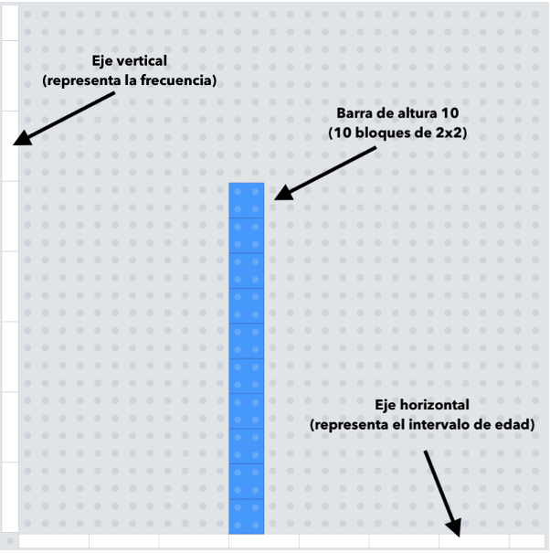
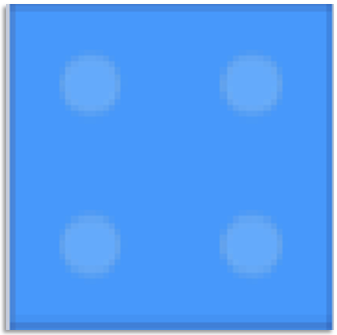
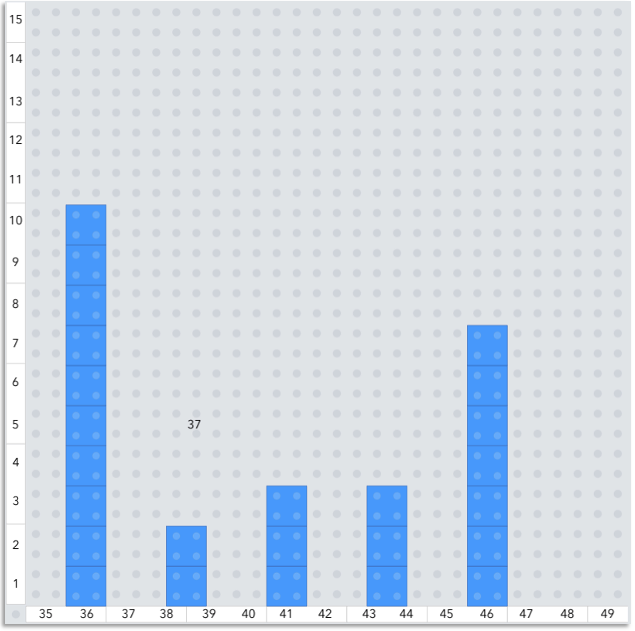

<style>
.registro-tablas table {
  width: 100%;
  border-collapse: collapse;
  font-size: 1rem;
  margin-bottom: 0;
}

.registro-tablas th,
.registro-tablas td {
  border: 1px solid #bfc5cc;
  padding: 10px 12px;
  text-align: left;
  vertical-align: middle;
}

.registro-tablas thead th {
  background: #d9d9d9;
  font-weight: 700;
}

.registro-tablas td:nth-child(2) {
  white-space: nowrap;
}
</style>

```{r, echo = FALSE, eval = TRUE, include = FALSE}

#---------------------------------------------------------------
# settings
#---------------------------------------------------------------

# start time
start_time <- Sys.time()

# hide messages from dplyr
suppressPackageStartupMessages(library(dplyr))

# hide NA from knitr table
options(knitr.kable.NA = '')

# suppress dplyr group warnings
options(dplyr.summarise.inform = FALSE)

# center figures
knitr::opts_chunk$set(echo = TRUE, fig.align="center")

#---------------------------------------------------------------
# load example data
#---------------------------------------------------------------

# load('rasch_example.RData')

```

# Actividad Clase 1

## Guía de actividad práctica I

### Propósito de la activiad

Cada grupo calculará los promedios de varias muestras aleatorias de edades de profesores. Luego, reunirá esos promedios en un histograma para observar la forma que toma su distribución. Esta actividad nos permitirá iniciar la discusión sobre el teorema del límite central a partir de evidencia construida por ustedes mismos.


## Organización general


-Modalidad	Actividad grupal de inicio de unidad.
-Integrantes	Grupos de 3 estudiantes. Si fuera necesario, un grupo podrá tener 4 integrantes.
-Material de trabajo	Set de muestras, calculadora, hoja de apoyo, Excel o formulario digital para registrar resultados.
-Datos entregados	Cada grupo recibirá un set con 12 muestras aleatorias de tamaño 40, formadas por edades de profesores tomadas desde una población.
-Producto final	Un histograma de frecuencias construido con los promedios muestrales del grupo y una breve interpretación oral.


## Objetivos de Aprendizaje 

- Calcular promedios muestrales a partir de varias muestras aleatorias del mismo tamaño.
- Representar la distribución de esos promedios mediante un histograma de frecuencias.
- Discutir cómo cambia la variabilidad del promedio cuando el tamaño de muestra se modifica.


## Desarrollo de la actividad


- Paso 1. Formación de grupos. Cada estudiante sacará un número desde una bolsa. Ese número indicará el grupo al que deberá integrarse. Una vez conformados, cada grupo se ubicará en su mesa de trabajo y recibirá un set de datos.

- Paso 2. Revisión del set de muestras. El grupo revisará su material. Cada grupo contiene 40 muestras distintas. Cada muestra tiene el registro de edades de 30 de profesores. Todas las muestras fueron seleccionadas aleatoriamente desde la misma población. Notará que 37 muestras ya tienen su promedio calculado, por lo que usted deberá completar los últimos 3 que faltan. [**Puede acceder a estos materiales aquí**](https://www.dropbox.com/scl/fi/hxgmyg1257qsfmq2o3kse/Grupos_1-10_formatoEXCEL.zip?rlkey=s3mtg6klxzkh5z2dqpzyj983i&dl=1)

- Paso 3. Cálculo de promedios muestrales. Para cada muestra, calculen el promedio. Denoten esos valores como $x_1,x_2,x_3,…,x_12$. Es decir, $x_1$ corresponde al promedio de la muestra 1, $x_2$  al promedio de la muestra 2, y así sucesivamente hasta completar las 40 muestras.

- Paso 4. Registro de resultados. Registren los 40 promedios en la hoja de resultados que el cuerpo docente le entregó, o bien, también puede usar una planilla Excel o en el espacio digital indicado por el docente. Es importante que todos los valores queden correctamente anotados.

- Paso 5. Construcción del histograma. Con los 40 promedios, construyan un histograma de frecuencias. El eje horizontal debe representar los promedios muestrales y el eje vertical la frecuencia. Observen si los promedios se concentran, si hay dispersión y si la forma del gráfico sugiere algún patrón reconocible.

- Paso 6. Interpretación grupal. Como grupo, elaboren una interpretación breve del histograma. No se busca una respuesta definitiva, sino una primera lectura basada en lo que observan en los datos y en el gráfico.


- Tiempo	Actividad
- 5 min	Formación de grupos y entrega del set de muestras.
- 20 min	Cálculo de los 12 promedios muestrales.
- 10 min	Registro de resultados y construcción del histograma.
- 10 min	Discusión e interpretación grupal.

## Registro de los datos

-Pueden usar esta estructura al momento de registrar los resultados en Excel o en el formulario digital.


:::: {.columns .registro-tablas}

::: {.column width="33%"}
| Muestra | Promedio muestral (años) |
|---|---|
| Muestra 1 | $\bar{x}_{1} = \underline{\hspace{1.8cm}}$ |
| Muestra 2 | $\bar{x}_{2} = \underline{\hspace{1.8cm}}$ |
| Muestra 3 | $\bar{x}_{3} = \underline{\hspace{1.8cm}}$ |
| Muestra 4 | $\bar{x}_{4} = \underline{\hspace{1.8cm}}$ |
| Muestra 5 | $\bar{x}_{5} = \underline{\hspace{1.8cm}}$ |
| Muestra 6 | $\bar{x}_{6} = \underline{\hspace{1.8cm}}$ |
| Muestra 7 | $\bar{x}_{7} = \underline{\hspace{1.8cm}}$ |
| Muestra 8 | $\bar{x}_{8} = \underline{\hspace{1.8cm}}$ |
| Muestra 9 | $\bar{x}_{9} = \underline{\hspace{1.8cm}}$ |
| Muestra 10 | $\bar{x}_{10} = \underline{\hspace{1.8cm}}$ |
| Muestra 11 | $\bar{x}_{11} = \underline{\hspace{1.8cm}}$ |
| Muestra 12 | $\bar{x}_{12} = \underline{\hspace{1.8cm}}$ |
| Muestra 13 | $\bar{x}_{13} = \underline{\hspace{1.8cm}}$ |
| Muestra 14 | $\bar{x}_{14} = \underline{\hspace{1.8cm}}$ |
:::

::: {.column width="33%"}
| Muestra | Promedio muestral (años) |
|---|---|
| Muestra 15 | $\bar{x}_{15} = \underline{\hspace{1.8cm}}$ |
| Muestra 16 | $\bar{x}_{16} = \underline{\hspace{1.8cm}}$ |
| Muestra 17 | $\bar{x}_{17} = \underline{\hspace{1.8cm}}$ |
| Muestra 18 | $\bar{x}_{18} = \underline{\hspace{1.8cm}}$ |
| Muestra 19 | $\bar{x}_{19} = \underline{\hspace{1.8cm}}$ |
| Muestra 20 | $\bar{x}_{20} = \underline{\hspace{1.8cm}}$ |
| Muestra 21 | $\bar{x}_{21} = \underline{\hspace{1.8cm}}$ |
| Muestra 22 | $\bar{x}_{22} = \underline{\hspace{1.8cm}}$ |
| Muestra 23 | $\bar{x}_{23} = \underline{\hspace{1.8cm}}$ |
| Muestra 24 | $\bar{x}_{24} = \underline{\hspace{1.8cm}}$ |
| Muestra 25 | $\bar{x}_{25} = \underline{\hspace{1.8cm}}$ |
| Muestra 26 | $\bar{x}_{26} = \underline{\hspace{1.8cm}}$ |
| Muestra 27 | $\bar{x}_{27} = \underline{\hspace{1.8cm}}$ |
| Muestra 28 | $\bar{x}_{28} = \underline{\hspace{1.8cm}}$ |
:::

::: {.column width="33%"}
| Muestra | Promedio muestral (años) |
|---|---|
| Muestra 29 | $\bar{x}_{29} = \underline{\hspace{1.8cm}}$ |
| Muestra 30 | $\bar{x}_{30} = \underline{\hspace{1.8cm}}$ |
| Muestra 31 | $\bar{x}_{31} = \underline{\hspace{1.8cm}}$ |
| Muestra 32 | $\bar{x}_{32} = \underline{\hspace{1.8cm}}$ |
| Muestra 33 | $\bar{x}_{33} = \underline{\hspace{1.8cm}}$ |
| Muestra 34 | $\bar{x}_{34} = \underline{\hspace{1.8cm}}$ |
| Muestra 35 | $\bar{x}_{35} = \underline{\hspace{1.8cm}}$ |
| Muestra 36 | $\bar{x}_{36} = \underline{\hspace{1.8cm}}$ |
| Muestra 37 | $\bar{x}_{37} = \underline{\hspace{1.8cm}}$ |
| Muestra 38 | $\bar{x}_{38} = \underline{\hspace{1.8cm}}$ |
| Muestra 39 | $\bar{x}_{39} = \underline{\hspace{1.8cm}}$ |
| Muestra 40 | $\bar{x}_{40} = \underline{\hspace{1.8cm}}$ |
:::

::::


## Preguntas para la discusión	

- 1. ¿Cuál fue el gran promedio del grupo, considerando los promedios obtenidos en las 12 muestras?
- 2. ¿Qué se observa en el histograma: concentración, dispersión, simetría o valores alejados?
- 3. ¿Qué creen que ocurriría con esta distribución si cada muestra tuviera tamaño 1?
- 4. ¿Qué creen que ocurriría si el tamaño de muestra aumentara muchísimo, por ejemplo, a valores muy grandes (100 mil casos, por ejemplo)?

## Cierre	

Al finalizar, cada grupo debería haber calculado sus promedios, construido su histograma y formulado una interpretación inicial. La pregunta para la casa será reflexionar qué ocurre cuando el tamaño de muestra disminuye hasta 1 o aumenta a valores muy grandes. Esa discusión se retomará en la siguiente clase para conectar la actividad con el teorema del límite central.


# Anexo: Construcción gráfico frecuencias con *bricks*


## Guía de construcción de histogramas con LEGO	

Esta guía orienta la construcción de histogramas con piezas LEGO para representar la distribución de los promedios muestrales. La actividad busca que las y los estudiantes observen, de forma concreta y visual, cómo se distribuyen varios promedios obtenidos a partir de muestras aleatorias de una misma población.

### Propósito de la actividad	

Cada grupo calculará el promedio de varias muestras de edades de profesores. Luego, esos promedios se organizarán en intervalos y se representarán en un histograma construido directamente sobre una base LEGO de 32x32. La intención no es solo graficar, sino también comenzar a discutir por qué los promedios muestrales suelen concentrarse en torno a un valor central.

### Materiales y organización	


:::: {.columns .registro-tablas}

::: {.column width="33%"}
| Tipo de brick | Uso en la actividad |
|---|---|
| Baseplate 32x32 |	Superficie de trabajo para construir un histograma completo por grupo. |
| Bloques 2x2 | Se apilan verticalmente para construir las barras del histograma. |
| Special Plates 4x1| Se usan para marcar el eje horizontal y el eje vertical.|
| Listado de muestras |Conjunto de datos a partir del cual se calculan los promedios muestrales. |
:::

::::


### Cómo se representa un histograma con LEGO	

En esta construcción del histograma, cada componente físico representa una parte del gráfico estadístico. Las barras muestran frecuencias, el eje horizontal organiza los intervalos y el eje vertical permite leer cuántos promedios quedaron en cada intervalo.


:::: {.columns .registro-tablas}

::: {.column width="33%"}
| Tipo de brick | ¿Qué representa? | Estrategía de uso  |
|---|---|
|Special Plate 4x1 en vertical| Eje vertical | Permite contar la frecuencia de cada intervalo.  |
| Special Plate 4x1 en horizontal  | Eje horizontal  |Marca la base desde la cual se levantan las barras.  |
| brick 2x2  | Altura de una barra  |Cada brick 2x2 equivale a 1 unidad de frecuencia.  |
:::

::::


A continuación, se muestra un ejemplo


{width=100%}


## Procedimiento para construir un histograma	

- Paso 1. Calcular los promedios muestrales. Cada grupo calcula el promedio de cada muestra. Si el grupo recibe 12 muestras, entonces obtendrá 12 promedios. Estos valores serán la base del histograma.

- Paso 2. Definir intervalos. Una vez obtenidos todos los promedios, el grupo determina intervalos de igual amplitud que permitan ordenar los resultados. Lo importante es que todos los promedios puedan ubicarse en algún intervalo.

- Paso 3. Contar frecuencias. Luego se cuenta cuántos promedios caen en cada intervalo. Ese conteo es la frecuencia que se representará con la altura de cada barra.

- Paso 4. Construir los ejes. En la base LEGO se construye primero el eje horizontal con plates 4x1 y luego el eje vertical, también con plates 4x1. Conviene dejar una separación clara entre el eje vertical y la primera barra.


- Paso 5. Escribir los valores en los ejes. Utiliza los plumones que te entregaron para escribir los intervalos de edades en el eje horizontal y las frecuencias en el eje vertical.

- Paso 6. Levantar las barras. Para cada intervalo se apilan bricks 2x2. Todas las barras deben partir desde la misma línea base.

- Paso 7. Revisar la forma global. Cuando el histograma esté completo, el grupo observa la forma general de la distribución y la compara con la de otros grupos. Esta observación será el punto de partida para discutir la distribución de promedios muestrales.

Construcción de un histograma


::: {layout="[[1,1], [1]]"}

{width=30%}

{width=30%}


:::


### Idea clave a considerar	

El histograma no representa los datos originales de cada muestra, sino la distribución de los promedios de esas muestras. Esa diferencia es central para introducir el teorema del límite central.
Para cerrar la actividad, discuta al menos las dos preguntas planteadas de la guía.


