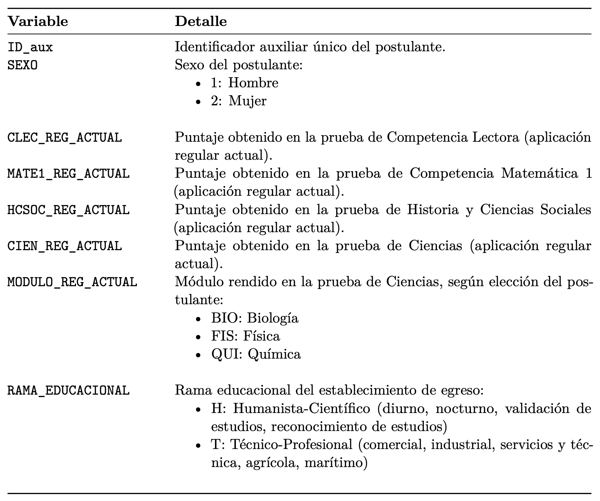

```{r, echo = FALSE, eval = TRUE, include = FALSE}

#---------------------------------------------------------------
# settings
#---------------------------------------------------------------

# start time
start_time <- Sys.time()

# hide messages from dplyr
suppressPackageStartupMessages(library(dplyr))

# hide NA from knitr table
options(knitr.kable.NA = '')

# suppress dplyr group warnings
options(dplyr.summarise.inform = FALSE)

# center figures
knitr::opts_chunk$set(echo = TRUE, fig.align="center")

#---------------------------------------------------------------
# load example data
#---------------------------------------------------------------

# load('rasch_example.RData')

```


# I. Contexto

La Prueba de Acceso a la Educación Superior (PAES) es un instrumento implementado por el Departamento de Evaluación, Medición y Registro Educacional (DEMRE) desde 2022, con el propósito de evaluar las competencias de los postulantes a la educación superior en Chile. Esta evaluación integra tanto *el saber* como el *saber hacer*, combinando conocimientos y habilidades para medir las competencias necesarias para un óptimo desempeño académico en la educación superior

Actualmente, el DEMRE pone a disposición bases de datos que contienen información relevante sobre los postulantes y quienes rinden las pruebas de acceso. Con fines didácticos e ilustrativos, en esta evaluación formativa se utilizará una base integrada construida a partir de dos conjuntos de datos obtenidos mediante el Portal de Transparencia del DEMRE.

Particularmente, en esta actividad se utilizará una base de datos que incluye a la totalidad de los postulantes que rindieron la PAES en su aplicación regular correspondiente al proceso de admisión 2025 (llevada a cabo en diciembre de 2024). Esta base considera tanto a estudiantes que cursaban su último año de enseñanza media como a personas egresadas que participaron en dicha instancia.

# II. Base de datos

Para acceder a los datos, haga click en el [siguiente link.](https://www.dropbox.com/scl/fi/ll72oefj67youqmwmgke3/datos_formativa02.xlsx?rlkey=k3jqe63mupnc1zm8t7dj2fd7h&dl=1)  

A continuación se muestra un extracto de la base de datos


```{r , echo=TRUE, warning=FALSE}
#| code-fold: true


paes <- readxl::read_excel('./01BasedeDatos/datos_formativa02.xlsx',
                          sheet='BaseDeDatos',col_names =T, na=c(""," ")
                         )
```

```{r tidy=FALSE,echo=FALSE,message=FALSE}

library(kableExtra)
  
knitr::kable(paes[1:10,],
             align = "c"
             #format.args = list(big.mark = ",")
             ) %>%
    row_spec(0, 
            bold = T,
            color = "white", 
            background = "black") %>%
  kable_styling(bootstrap_options = c("striped", "hover"), 
                position = "center", 
                full_width = FALSE, 
                latex_options = "HOLD_position",
                html_font='helvetica',
                font_size = 8
                )

```


A continuación se muestra el diccionario de la base de datos. En particular, se tiene un identificador auxiliar de los postulantes, sexo, rama educacional del establecimiento de egreso y los puntajes obtenidos en las distintas áreas evaluadas por la PAES, a saber: Comprensión Lectora, Competencia Matemática M1, Competencia Matemática M2 e Historia y Ciencias Sociales. Asimismo, se incluyen los resultados del módulo electivo de Ciencias —Biología, Física o Química— según la elección realizada por cada postulante, junto con una variable que identifica cuál de estas tres pruebas fue rendida.


{width=70%}

Si lo desea, los datos originales se pueden descargar en la página oficial del DEMRE  [pinchar aquí.](https://portal-transparencia.demre.cl/portal-base-datos) Seleccione la prueba y el año respectivo.


# Ejercicio 1: Introducción

Para este ejercicio, se seleccionaron de la base de datos aquellos postulantes que rindieron la prueba electiva de Ciencias. Posteriormente, se aplicaron dos pruebas $t$ de Student con el propósito de verificar la significancia estadística de las diferencias entre los promedios de puntajes obtenidos por quienes rindieron Física y Química, así como también entre Biología y Física. A continuación, se presentan las salidas generadas por R tras la ejecución de dichas pruebas.

**Ouput prueba t para el caso Física y Química**


```{r , echo=TRUE, eval=FALSE,warning=FALSE}
#| code-fold: true

#-----------------------------------------------
# Creando tres tablas para cada prueba electiva
#-----------------------------------------------

FIS <- paes %>%
      dplyr::filter(MODULO_REG_ACTUAL=="FIS")    # Filtramos solo para el caso de estudiantes que rindieron FISICA

BIO <- paes %>%
  dplyr::filter(MODULO_REG_ACTUAL=="BIO")        # Filtramos solo para el caso de estudiantes que rindieron BIOLOGIA

QUIM <- paes %>%
  dplyr::filter(MODULO_REG_ACTUAL=="QUI")         # Filtramos solo para el caso de estudiantes que rindieron QUIMIA


#-----------------------------------------------
# Prueba t entre FIS - QUI
#-----------------------------------------------

t.test(FIS$CIEN_REG_ACTUAL,QUIM$CIEN_REG_ACTUAL,conf.level=0.95,var.equal=T)

```

{width=70%}


**Ouput prueba t para el caso Física y Biología**


```{r , echo=TRUE, eval=FALSE, warning=FALSE}
#| code-fold: true

#-----------------------------------------------
# Prueba t entre FIS - BIO
#-----------------------------------------------

t.test(FIS$CIEN_REG_ACTUAL,BIO$CIEN_REG_ACTUAL,conf.level=0.95,var.equal=T)


```


{width=70%}

En el siguiente video se presentan, en BlueSky Statistics, las salidas de las dos pruebas $t$ descritas anteriormente.


::: {#fig-bluesky_tTest}




:::


### Pregunta A

¿Cómo se interpretan las salidas antes expuestas? En particular, para
cada caso indique qué significa:

- $t$
- $df$
- $p-$value (valor p)
- percent confidence interval (o  intervalo de confianza al $95\%$)

### Pregunta B

Considerando las salidas ¿Qué se puede decir acerca de las diferencias en promedio de los puntajes de cada pareja de módulos?


### Pregunta C

¿Sería apropiado afirmar que la prueba de Física es la más difícil, considerando los puntajes obtenidos? Por qué?


 **Solución**

::: panel-tabset


# Pregunta A

::: {.callout-tip collapse="true" title="Ver solución"}

- $t$: Valor del estadístico $t$, expresa la magnitud de la diferencia estandarizada entre los promedios de los grupos comparados.

- $df$: Grados de libertad asociados a la prueba, que dependen del tamaño muestral y del tipo de prueba aplicada
- $p-$value (valor p): Nivel de significancia asociado al valor observado de $t$; permite determinar si la diferencia observada es estadísticamente significativa.
- percent confidence interval (o  intervalo de confianza al $95\%$): percent confidence interval] Rango de valores dentro del cual se espera que se encuentre la verdadera diferencia de medias poblacionales con un 95$\%$ de confianza.


:::


# Pregunta B

::: {.callout-tip collapse="true" title="Ver solución"}

 En ambos casos, Física–Química y Física–Biología, las pruebas $t$ arrojan valores de $p$-valor  menores que $0.05$ ($p < 2.2 \times 10^{-16}$), lo que permite rechazar la hipótesis nula de igualdad de medias. Esto indica que existen diferencias estadísticamente significativas entre los promedios de puntajes obtenidos por los postulantes en los distintos módulos evaluados.
  
  En el caso de Física y Química, la prueba $t$ arrojó un resultado significativo, $t(43370) = -8.47$, $p < .001$, con un intervalo de confianza, 95$\%$ CI [–12.97, –8.10]. Por lo tanto, es posible afirmar que en promedio, quienes rindieron Química obtuvieron puntajes más altos ($M = 534.44$) que quienes rindieron Física ($M = 523.91$).

  Para el caso de Física y Biología, la prueba fue igualmente significativa, $t(110045) = 71.31$, $p < .001$, con un intervalo de confianza, 95$\%$ CI [53.77, 56.81]. Por lo tanto,  los postulantes que rindieron Física obtuvieron un promedio más alto ($M = 523.91$) en comparación con quienes rindieron Biología ($M = 468.61$)

:::


# Pregunta C

::: {.callout-tip collapse="true" title="Ver solución"}

No sería apropiado concluir que la prueba de Física es la más difícil únicamente con base en los puntajes promedio. Si bien los postulantes que rindieron Física obtuvieron puntajes inferiores a los de Química, también superaron ampliamente a quienes rindieron Biología. La dificultad de una prueba no puede determinarse exclusivamente por los promedios obtenidos, ya que estos pueden estar influidos por factores como el perfil de los postulantes que optan por cada módulo.

  Desde una perspectiva estrictamente descriptiva, Biología presenta los puntajes más bajos, seguida por Física y luego Química. No obstante, para afirmar con rigurosidad que una prueba es “más difícil”, sería necesario considerar elementos adicionales como los niveles de habilidad medidos, la distribución de ítems, la población evaluada y el análisis psicométrico de las pruebas, entre otros factores.

:::

:::


# Ejercicio 2


Siguiendo una lógica similar al ejercicio anterior, nos proponemos realizar un análisis para comparar los puntajes promedio entre dos grupos, con el propósito de contrastar una hipótesis de diferencia de medias. En particular, se busca contrastar la hipótesis de diferencia en los puntajes obtenidos en la prueba de **Competencia Matemática M1** entre postulantes de sexo masculino y femenino. Para ello, responda las siguientes preguntas:


## Pregunta A: Formulación de hipótesis

Plantee la Hipótesis Nula ($H_0$) y la Hipótesis Alternativa ($H_1$) correspondientes al análisis.

## Pregunta B: Aplicación de prueba estadística 

Realice una prueba $t$ para muestras independientes (ya sea en *R* o en *BlueSky Statistics*), asumiendo igualdad de varianzas entre los grupos con el fin de simplificar el análisis. Esta prueba tiene como objetivo evaluar la existencia de diferencias significativas en los puntajes de la prueba M1 según el sexo del postulante.

## Pregunta C: Análisis e interpretación

Reflexione sobre los resultados obtenidos y elabore con sus propias palabras una interpretación de las diferencias observadas entre los grupos comparados.


## Pregunta D: Reporte en Formato APA

Ahora, se le solicita reportar los resultados utilizando un lenguaje técnico y formal. Para ello, siga las siguientes instrucciones:

### Reporte en formato Tabla

Presente en una tabla los resultados obtenidos, asegurándose de incluir: estadístico $t$, grados de libertad ($df$), nivel de significancia ($p$-value), medias ($M$) y desviaciones estándar ($SD$) por grupo. Para reportar una prueba $t$ en formato APA, consulte el 
[siguiente link](https://apastyle.apa.org/style-grammar-guidelines/tables-figures/sample-tables#tests) 

### Reporte verbal

Redacte un párrafo en el cual se reporten los resultados siguiendo las convenciones del estilo APA, incorporando valores numéricos relevantes e información sobre la significancia estadística. Siga la estructura de reporte expuesta en clases.

### Interpretación y discusión de resultados

Analice si se debe rechazar o no la hipótesis nula, y discuta qué implicancias tienen los hallazgos para los grupos analizados, considerando tanto la significancia estadística como la relevancia práctica de la diferencia observada.

### Toma de decisiones

Desde la perspectiva de un(a) director(a) del DEMRE, proponga una decisión o curso de acción (si lo ve posible) fundamentado en la evidencia obtenida.

- **Nota**: Se recomienda no centrarse exclusivamente en la significancia estadística. Una pregunta fundamental que debe considerarse es el *tamaño del efecto*. ¿La diferencia observada es pequeña, mediana o grande? Esta reflexión es clave para una adecuada toma de decisiones basada en datos.


 **Solución**

::: panel-tabset


# Pregunta A

::: {.callout-tip collapse="true" title="Ver solución"}

La hipótesis nula es:

$$
H_0: \mu_{\text{hombres}} = \mu_{\text{mujeres}}
$$

Y la hipótesis alternativa es:

$$
H_1: \mu_{\text{hombres}} \neq \mu_{\text{mujeres}}
$$

En este caso, la hipótesis nula plantea que no existen diferencias en el puntaje promedio de M1 entre ambos grupos, mientras que la hipótesis alternativa plantea que sí existe una diferencia estadísticamente significativa entre sus medias. Note que la hipótesis está planteada sin dirección, es decir, solo aborda si existe una diferencia, pero no cuál de las dos medias es mayor o menor que la otra.


:::


# Pregunta B

::: {.callout-tip collapse="true" title="Ver solución"}
## Pregunta B: Aplicación de prueba estadística

Se realizó una prueba $t$ de Student para muestras independientes, asumiendo igualdad de varianzas entre los grupos. El análisis se efectuó sobre un total de 223181 casos, correspondientes a 104660 postulantes hombres y 118521 postulantes mujeres. 


::: {.callout-tip collapse="true" title="Ver análisis en R"}




:::

::: {.callout-tip collapse="true" title="Ver análisis en BlueSky"}

Prontamente...

:::

:::


# Pregunta C

::: {.callout-tip collapse="true" title="Ver solución"}
Los resultados indican que existe una diferencia estadísticamente significativa en los puntajes promedio de la prueba M1 según el sexo del postulante. En este caso, la diferencia de medias fue de 45.27 puntos a favor del grupo de hombres. 

**Nota 1:** Una pregunta relevante tiene relación con evaluar si la diferencia observada es grande, moderada o pequeña. De manera rápida, si comparamos esta diferencia con respecto a la desviación estándar del grupo de las mujeres, observamos que solo corresponde al $45.27/136.42=0.33$, lo que indica que esta diferencia equivale a un tercio de una desviación estándar del grupo de las mujeres. Por lo tanto, si bien la diferencia es estadísticamente significativa, existe todavía un amplio solapamiento entre las distribuciones de puntajes de hombres y mujeres. La siguiente figura muestra este solapamiento:


```{r , echo=FALSE, warning=FALSE}
#| code-fold: false

library(dplyr)
library(ggplot2)
library(scales)

# Seleccionar y limpiar variables
datos_plot <- paes %>%
  select(SEXO, MATE1_REG_ACTUAL) %>%
  filter(!is.na(SEXO), !is.na(MATE1_REG_ACTUAL)) %>%
  filter(MATE1_REG_ACTUAL!=0) %>%
  mutate(
    sexo_grupo = case_when(
      SEXO %in% c(1, "1") ~ "Hombres",
      SEXO %in% c(2, "2") ~ "Mujeres",
      TRUE ~ as.character(SEXO)
    )
  ) %>%
  filter(sexo_grupo %in% c("Hombres", "Mujeres"))


# Calcular medias por grupo para etiquetar
medias <- datos_plot %>%
  group_by(sexo_grupo) %>%
  summarise(media = mean(MATE1_REG_ACTUAL), .groups = "drop")


# Boxplot
ggplot(datos_plot, aes(x = sexo_grupo, y = MATE1_REG_ACTUAL, fill = sexo_grupo)) +
  geom_boxplot(alpha = 0.7, width = 0.6, outlier.alpha = 0.15) +
  scale_fill_manual(values = c("Mujeres" = "#FDCB56", "Hombres" = "#F5626A")) +
  scale_y_continuous(labels = label_number(big.mark = ".", decimal.mark = ",")) +
  labs(
    title = "Distribución de puntajes M1 según sexo",
    x = "Grupo",
    y = "Puntaje Competencia Matemática M1",
    fill = "Grupo"
  ) +  geom_text(
    data = medias,
    aes(x = sexo_grupo, y = media, label = paste0("M = ", round(media, 2))),
    inherit.aes = FALSE,
    vjust = -1,
    size = 4
  ) +
  theme_minimal(base_size = 13) +
  theme(
    plot.title = element_text(face = "bold"),
    legend.position = "none"
  )

```


Esto sugiere que la diferencia existe, pero no es de una magnitud tan grande como para justificar conclusiones sobre el desempeño de ambos grupos. Esto ocurre en un contexto de tamaño muestral muy grande, por lo que era esperable detectar significancia incluso ante diferencias de magnitud moderada o pequeña.  Por lo tanto, usualmente lo que se hace es complementar la significancia estadística con un estadístico que dé cuenta del tamaño del efecto para indicar qué tan grande o pequeña podría ser la diferencia observada. Esto no fue un aspecto que se vio formalmente en clases, pero se abordará cuando avancemos a la unidad 2 del curso.

:::


# Pregunta D

::: {.callout-tip collapse="true" title="Ver solución"}

### Reporte en formato Tabla

| Grupo   | n      | M      | SD     | t     | df     | p      |
|:--------|-------:|-------:|-------:|------:|-------:|:-------|
| Hombres | 104660 | 642.22 | 152.67 | 73.98 | 223179 | < .001 | 
| Mujeres | 118521 | 596.95 | 136.42 |       |        |        |

**Nota 1.** Prueba $t$ de Student para muestras independientes asumiendo igualdad de varianzas. 


### Reporte verbal

Se realizó una prueba $t$ de Student para muestras independientes con el fin de comparar los puntajes promedio en la prueba de Competencia Matemática M1 entre postulantes hombres y mujeres, asumiendo igualdad de varianzas. Los resultados mostraron diferencias estadísticamente significativas entre ambos grupos, $t(223179) = 73.98$, $p < .001$. En promedio, los hombres obtuvieron puntajes más altos ($M = 642.22$, $SD = 152.67$) que las mujeres ($M = 596.95$, $SD = 136.42$).

### Interpretación y discusión de resultados

Dada la evidencia, se opta por rechazar la hipótesis nula de igualdad de medias, ya que la evidencia muestra una diferencia estadísticamente significativa entre hombres y mujeres en los puntajes de la prueba M1. Sin embargo, la interpretación no debe centrarse exclusivamente en el rechazo de $H_0$. Dado el gran tamaño de la muestra, incluso diferencias relativamente pequeñas pueden resultar significativas. En este caso, el tamaño del efecto sugiere que la diferencia es pequeña, por lo que la relevancia práctica del hallazgo debe ser interpretada con cautela.

Desde una perspectiva aplicada, esto implica que sí existen diferencias promedio entre los grupos, pero estas no necesariamente reflejan una brecha amplia o sustantiva a nivel individual. Por lo mismo, cualquier discusión sobre equidad, acceso o desempeño debiera complementarse con análisis adicionales, por ejemplo, examinando distribución de puntajes, variables contextuales, sesgo de ítems o posibles diferencias asociadas al origen escolar, nivel socioeconómico u otros factores relevantes.

### Toma de decisiones

Desde la perspectiva de un(a) director(a) del DEMRE, estos resultados no serían suficientes, por sí solos, para justificar una modificación inmediata del instrumento o de sus criterios de uso. La evidencia muestra una diferencia estadísticamente significativa, pero de magnitud pequeña. Por ello, una decisión razonable sería profundizar el análisis antes de adoptar medidas de alto impacto. Por ejemplo, sería recomendable monitorear sistemáticamente estas diferencias entre grupos e impulsar estudios complementarios sobre el funcionamiento del instrumento (análisis de sesgo y/o funcionamiento diferencial de ítems (DIF)). En este sentido, la decisión más cauta sería no sobrerreaccionar frente a la significancia estadística, sino avanzar hacia una evaluación más completa de la relevancia práctica y de las posibles causas de la diferencia observada.


:::


:::


# Ejercicio 3

A partir de la misma base de datos utilizada en esta evaluaci\'on, se propone realizar un análisis comparativo de puntajes promedio entre grupos, con el propósito de contrastar hipótesis de diferencia de medias en distintas áreas evaluadas por la PAES.

En particular, se busca evaluar si existen diferencias estadísticamente significativas entre postulantes que provienen de establecimientos **Científico-Humanistas** y **Técnico-Profesionales** en relación con los puntajes de las siguientes dos pruebas:

- Puntajes obtenidos en la prueba de **Competencia Matemática M1**.
- Puntajes obtenidos en la prueba de **Competencia Lectora**.

Para ello, realiza dos pruebas $t$ para muestras independientes (una prueba para cada prueba), asumiendo igualdad de varianzas entre los grupos, con el objetivo de simplificar el análisis. Estas pruebas tienen como propósito evaluar posibles diferencias significativas en el rendimiento promedio según el tipo de establecimiento educacional para cada prueba.

Una vez realizados los análisis estadísticos, se espera que puedas reflexionar sobre los resultados obtenidos e interpretes las diferencias observadas en función del tipo de establecimiento de egreso en cada una de las pruebas evaluadas. Luego, una vez que hayas realizado estas dos pruebas, responde las siguientes preguntas:


## Pregunta A: Reporte en Formato APA

Ahora, se le solicita reportar los resultados utilizando un lenguaje técnico y formal, mediante los siguientes elementos:

### Reporte tabular

Presente los resultados obtenidos para cada prueba. La tabla debe incluir: valor del estadístico $t$, grados de libertad ($df$), nivel de significancia ($p$-value), medias ($M$) y desviaciones estándar ($SD$) para cada grupo comparado.

### Reporte verbal

Redacte un párrafo en el cual se reporten los resultados siguiendo las convenciones del estilo APA, incorporando valores numéricos relevantes e incorporando información sobre la significancia estadística. Siga la estructura de reporte expuesta en clases.

### Interpretación y discusión

Elabore una interpretación clara de los resultados obtenidos. ¿Se rechaza o no la hipótesis nula en cada caso? ¿Qué implicancias tienen los hallazgos respecto de las diferencias entre grupos?

### Decisión institucional

Si usted tuviera el rol de director(a) del DEMRE, ¿qué tipo de decisión o reflexión institucional adoptaría a partir de la evidencia observada en estos resultados?


- **Nota final:** Se sugiere no centrar la discusión exclusivamente en la significancia estadística. Una pregunta clave que debe abordarse es el *tamaño del efecto*. ¿La diferencia encontrada es pequeña, mediana o grande desde una perspectiva práctica? Este aspecto resulta esencial para una adecuada toma de decisiones informada por los datos.


